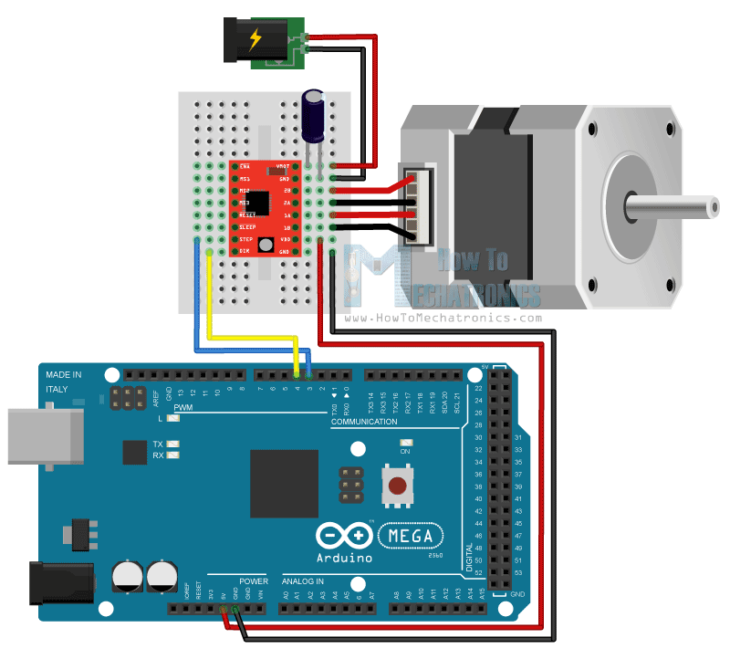

ExoArm: Open-Source Robotic Exoskeleton Arm

ExoArm is a solo-engineered project, fully 3D-printable robotic exoskeleton arm designed to assist in upper limb physiotherapy. Desgined for the purpose of ensuring access to an affordable alternative to exoskeletons in less economoically developed countries. This system is built using stepper motors, flex sensors, and an Arduino-based control system, maintaining a total cost under £110.

---

## Features

- Arduino-based closed-loop control using flex sensors (sensors can be replaced with various types)
- Stepper motors via Arduino driver boards
- 3D-printable design (created fully in Fusion 360)
- Fully open-source: software, and CAD fully implemented, only hardware components require purchase

---

## Parts List With Prices

The following is a list of components needed to build the ExoArm prototype. Prices are approximate as of 2025.

| Component                             | Qty | Cost (GBP) | Link |
|---------------------------------------|-----|------------|------|
| Arduino Uno R4 Minima (or similar)    | 1   | £15        | [Arduino](https://store.arduino.cc/products/uno-r4-minima) |
| NEMA 17 Stepper Motor                 | 1   | £10        | [Example](https://www.amazon.co.uk/s?k=nema+17+stepper+motor) |
| A4988 Stepper Driver                  | 1   | £3         | [Example](https://www.amazon.co.uk/s?k=a4988+stepper+driver) |
| 10μF Capacitor (for A4988)            | 1   | £0.50      | - |
| Matrix Board (Prototype PCB)          | 1   | £2         | [Example](https://www.amazon.co.uk/s?k=matrix+board+prototype) |
| 10kΩ Resistor                         | 2   | £0.20      | - |
| Flex Sensor                           | 1   | £12        | [Example](https://www.amazon.co.uk/s?k=flex+sensor) |
| Switch (Tactile or Toggle)            | 1   | £0.50      | [Example](https://www.amazon.co.uk/s?k=tactile+switch) |
| 11.1V LiPo Battery (650mAh)           | 1   | £12        | [Turnigy Battery](https://hobbyking.com/en_us/turnigy-graphene-panther-650mah-3s-75c-battery-pack-w-xt30.html) |
| 5mm Steel Rod                         | 1   | £9         | [Amazon](https://amzn.to/3HMBGeV) |
| Thin Wall Bearings                    | 2   | £6         | [Option 1](https://amzn.to/3gtYLqG), [Option 2](https://amzn.to/3H7JPZY) |
| M3 Screws (Assorted Set)              | 1   | £4         | [Example](https://www.amazon.co.uk/s?k=m3+screw+set) |
| Velcro Straps                         | 2   | £7         | [Amazon UK](https://www.amazon.co.uk/Self-Adhesive-Securing-Buckles-Adjustable-Reusable/dp/B089CHPHL3) |
| PLA Filament (for 3D printing)        | 1 roll | £10     | [Example](https://www.amazon.co.uk/s?k=pla+filament) |

**Total Estimated Build Cost:** ~£90–110 

---

## Step By Step Hardware Setup (3D printer required)

1. Print components (CAD designs found under `/cad`)
2. Attach flex sensors to any glove, using adhesive (tape, glue gun, etc)
3. Wire sensors to Arduino (diagram below)
4. Wire A4988 to drive NEMA 17, attatch both to the arduino (diagram below)
5. Upload code from `/code` directory
6. Connect Arduino board to computer and run code
7. Disconnect after confirming successful operation
8. Use freely

---

## Wiring Diagram

---

## CAD Design

You can download the .STL files from the `/cad` folder.

## Demo Video

---
## 🙋‍♂️ Author

**Nouman Shiekh Hassan Awwad**  
Mechatronics Engineer | [LinkedIn](https://www.linkedin.com/in/nouman-awwad/) | [GitHub](https://github.com/NoumanAwwad)

